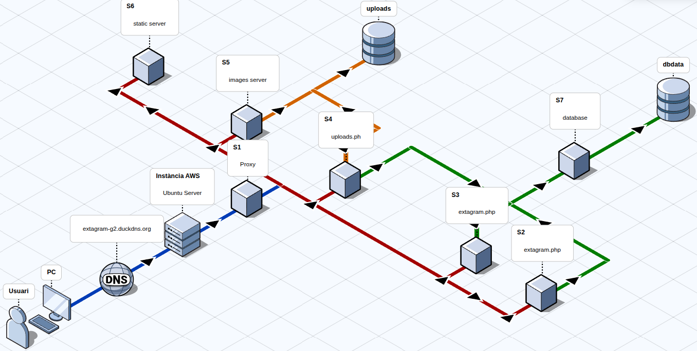

# Extagram G2 - High Availability Social Platform


> **Projecte 0.1:** Desplegament d’una infraestructura escalable basada en microserveis per a una xarxa social d'imatges.

---

## Índex
1. [Descripció del Projecte](#descripció-del-projecte)
2. [Sprints](./sprints.md)
3. [Investigació](./Investigacio.md)
4. [Arquitectura del Sistema](#arquitectura-del-sistema)
5. [Tecnologies Utilitzades](#tecnologies-utilitzades)
6. [Serveis desplegats](#serveis-desplegats)
    * [Aplicació Web](./Web/web.md)
7. [Full de Ruta (Roadmap)](#full-de-ruta-sprints)
8. [Instal·lació i Desplegament](#instal·lació-i-desplegament)
9. [Equip de Desenvolupament](#equip-de-desenvolupament)

---

## Descripció del Projecte

**Extagram G2** és una aplicació web tipus xarxa social que permet als usuaris publicar text i imatges en temps real. Més enllà de la funcionalitat d'usuari, el valor principal d'aquest projecte resideix en la seva **infraestructura de sistemes**.

L'objectiu ha estat migrar d'un entorn monolític (Sprint 1) a una arquitectura de **microserveis contenidoritzats d'alta disponibilitat** (Sprint 2 i 3). El sistema està dissenyat per suportar fallades, balancejar la càrrega de trànsit i segregar responsabilitats entre diferents nodes.

### Funcionalitats Principals
* Feed de publicacions en temps real.
* Pujada d'imatges amb validació de seguretat.
* **Panell d'Administració:** Gestió de contingut i eliminació de posts.
* **Alta Disponibilitat:** Replicació de dades i serveis redundants.
* **Seguretat:** Connexió HTTPS i aïllament de xarxes internes.

---

## Arquitectura del Sistema

El projecte utilitza **Docker Compose** per orquestrar 7 serveis interconnectats, seguint un model de responsabilitat única. El trànsit és gestionat per un Proxy Invers que distribueix les peticions segons el tipus de contingut.

### Diagrama de Serveis (Microserveis)

| ID | Servei (Container) | Funció | Descripció Tècnica |
| :--- | :--- | :--- | :--- |
| **S1** | `nginx:alpine` | **Proxy Invers & Load Balancer** | Porta d'entrada (Gateway). Distribueix trànsit entre S2/S3 (App) i serveix estàtics des de S5/S6. |
| **S2** | `php:fpm` | **App Logic (Node A)** | Processa la lògica principal (`extagram.php`). |
| **S3** | `php:fpm` | **App Logic (Node B)** | Rèplica de S2 per a alta disponibilitat i balanceig. |
| **S4** | `php:fpm` | **Upload Manager** | Microservei dedicat exclusivament a la càrrega d'imatges (`upload.php`). |
| **S5** | `nginx:alpine` | **Static: Images** | Servidor optimitzat per servir les imatges pujades pels usuaris (`/uploads`). |
| **S6** | `nginx:alpine` | **Static: Assets** | Servidor optimitzat per servir CSS, JS i SVGs del sistema. |
| **S7** | `mysql:8.0` | **Base de Dades** | Persistència de dades (Taula `posts`). Accessible només des de la xarxa interna de backend. |

### Disseny de Xarxa
El sistema implementa xarxes Docker (`docker network`) per aïllar la base de dades del trànsit públic:
* **Frontend Network:** Connecta S1, S5, S6.
* **App Network:** Connecta S1, S2, S3, S4.
* **Backend Network:** Connecta S2, S3, S4 amb S7 (Base de Dades).


---

## Tecnologies Utilitzades

* **Infraestructura:** AWS EC2 (Ubuntu Server).
* **Contenidors:** Docker & Docker Compose.
* **Servidors Web:** NGINX (Reverse Proxy & Static Web Server).
* **Backend:** PHP 8.2 (PHP-FPM).
* **Base de Dades:** MySQL 8.0.
* **Control de Versions:** Git & GitHub.
* **Seguretat:** OpenSSL (Certificats), SSH Key Pairs.

---

## Full de Ruta (Sprints)

El desenvolupament s'ha dut a terme seguint la metodologia **SCRUM** en 3 sprints quinzenals:

### Sprint 1: MVP & Infraestructura Base
* **Dates:** 15/12/2025 - 19/01/2026
* Configuració inicial d'AWS (EC2, Security Groups).
* Desenvolupament de l'aplicació monolítica (LAMP Stack).
* Repositori GitHub i claus SSH.

### Sprint 2: Dockerització i Microserveis
* **Dates:** 19/01/2026 - 02/02/2026
* Migració a contenidors Docker.
* Implementació del Proxy Invers (S1) i segregació de serveis (S2-S7).
* Implementació d'HTTPS i Domini propi.
* Desenvolupament del **Panell d'Administració**.

### Sprint 3: Consolidació i Xarxa
* **Dates:** 02/02/2026 - 10/02/2026
* Refactorització de la xarxa interna de Docker (Networking).
* Testing d'estrès i validació de connectivitat.
* Documentació tècnica final.

---

## Instal·lació i Desplegament

Per desplegar el projecte en un entorn local o servidor:

1.  **Clonar el repositori:**
    ```bash
    git clone https://github.com/AdrianGonzalez-ITB2425/P0.1-ASIXc2gA-G02
    cd extagram-docker
    ```

2.  **Configurar variables d'entorn:**
    Crea un fitxer `.env` a l'arrel basat en l'exemple per configurar les credencials de la BD.

3.  **Aixecar l'arquitectura:**
    ```bash
    docker-compose up -d --build
    ```

4.  **Verificar l'estat dels contenidors:**
    ```bash
    docker-compose ps
    ```
    *Hauries de veure 7 contenidors actius (S1-S7).*

---

## Equip de Desenvolupament

Projecte realitzat per l'equip **G2** (Curs 2025/2026):

| Membre | Rols Principals |
| :--- | :--- |
| **Javier Vericat** | Scrum Master, Documentació |
| **Adrián González** | DevOps, Infraestructura AWS,  Arquitectura Docker, Frontend Assets (Nginx) |
| **Marc Manzorro** | Backend Developer (PHP), Base de Dades, Seguretat |

---
*© 2026 Extagram G2 - Projecte 0.1 ASIXc2A - Institut Tecnològic de Barcelona.*