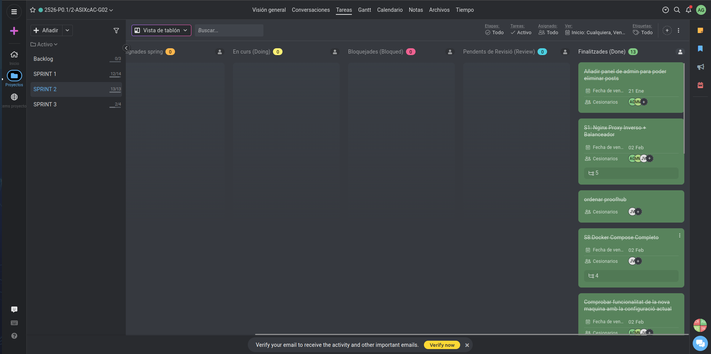
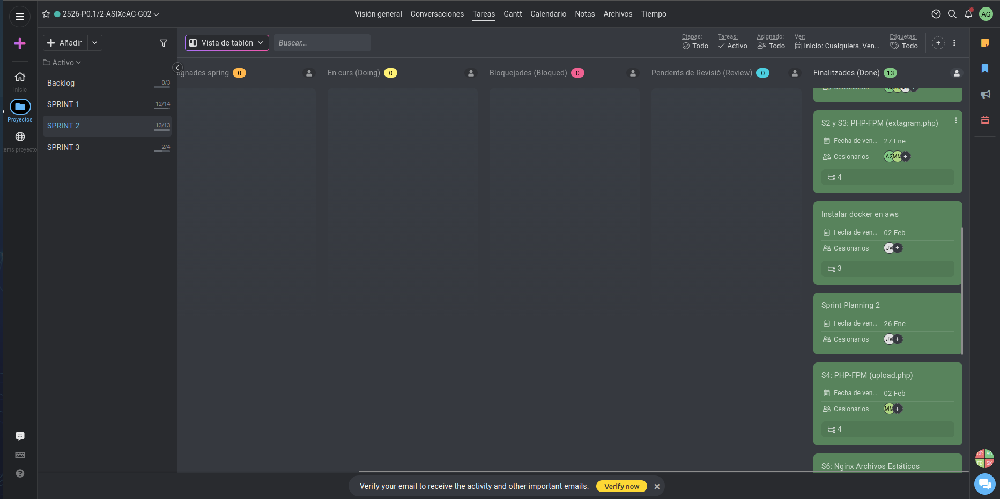

# ACTA DE REUNIÓ - SPRINT 2

**Projecte:** Extagram G2  
**Data:** 2 de febrer de 2026  
**Hora:** 15:00  

---

## ASSISTENTS

Adrián González  
Javier Vericat  

---

## TASQUES COMPLETADES

### 1. Infraestructura de Contenidors
* **Muntatge de l'esquema:** S'ha dissenyat i desplegat tota l'arquitectura de l'aplicació mitjançant contenidors.
* **Gestió de serveis:** Separació de rols (servidor web, base de dades) per millorar la modularitat.

### 2. Domini i Automatització
* **Configuració de domini:** L'aplicació ja és accessible des d'un nom de domini personalitzat.
* **Actualització d'IP (Crontab):** S'ha programat una tasca automàtica al sistema per detectar canvis en l'IP pública i actualitzar el domini sense intervenció manual.

### 3. Seguretat HTTPS
* **Certificació SSL:** Configuració del protocol HTTPS per garantir la privadesa de les dades i la confiança de l'usuari.
* **Configuració del servidor:** Redirecció forçada de trànsit no segur a l'entorn xifrat.

### 4. Millores en l'Aplicació Web
* **Optimització de Codi:** Millora profunda del **PHP** i el **CSS** per a un rendiment més ràpid i un disseny més polit.
* **Portal d'Administració:** S'ha afegit una funcionalitat clau que permet als administradors gestionar el feed i eliminar publicacions directament des de la interfície.

---

## TASQUES PENDENTS (BACKLOG)

### 1. Hardening de Xarxa (Docker Networks)
* **Aïllament de contenidors:** Cal ajustar la configuració de xarxa perquè els contenidors només es vegin entre si segons el flux de dades estricte definit a l'esquema del document. 
* **Seguretat interna:** Restringir l'accés a la base de dades perquè només sigui accessible des del contenidor de l'aplicació.

---

## RESUM EXECUTIU

| Categoria                 | Valor     |
|---------------------------|-----------:|
| Tasques completades       | 10         |
| Tasques pendents          | 1          |
| Percentatge completat     | 91 %       |
| Seguretat de connexió     | HTTPS      |
| Infraestructura           | Docker     |

**Estat del projecte:** L'infraestructura és robusta i l'aplicació està en línia amb domini propi. El proper focus és la seguretat interna de la xarxa.

---

## ESTAT ACTUAL

**Funciona:**
* Accés per domini oficial amb seguretat **HTTPS**.
* Automatització de la IP operativa via **Crontab**.
* Portal d'administració funcional (esborrat de posts actiu).
* Disseny visual millorat i responsive.

**Pendent:**
* Arreglar l'esquema de xarxa interna dels contenidors per limitar la visibilitat segons el pla de seguretat.

---

## CONCLUSIÓ

L'equip ha tancat amb èxit la fase de desplegament professional. Amb el sistema de contenidors en marxa, el domini configurat i el panell d'administració operatiu, Extagram G2 es troba en una fase madura. El següent sprint se centrarà en el poliment de la seguretat de xarxa per complir amb els estàndards del disseny original.

---

**Acta redactada:** 02/02/2026 – 15:09 CET  
**Responsable:** Equip Extagram G2

[Torna a l'Inici](../../README.md)