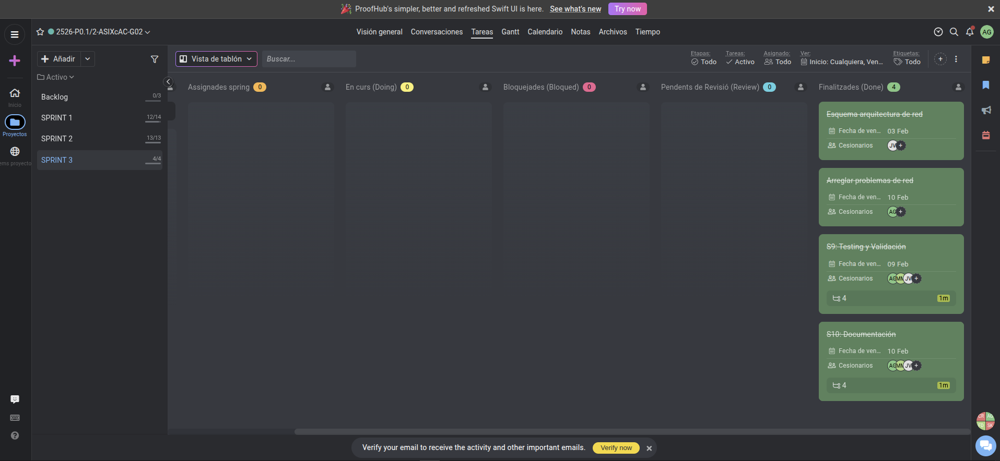
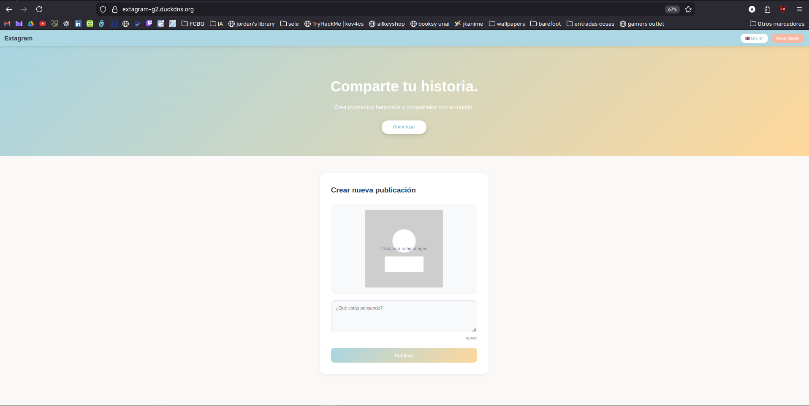
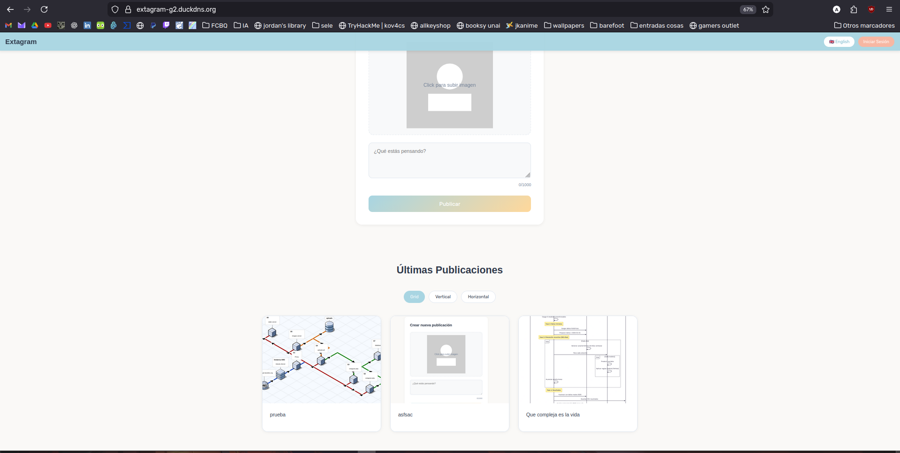

# ACTA DE REUNIÓ - SPRINT 3

**Projecte:** Extagram G2  
**Data:** 10 de febrer de 2026  
**Hora:** 15:00 h

---

## ASSISTENTS

Adrián González  
Javier Vericat  
Marc Manzorro  

---

## TASQUES COMPLETADES

### 1. Hardening de Xarxa (Docker Networks)
**Responsable:** Adrián González
* **Segregació de xarxes:** S'ha implementat la divisió tècnica entre `extanet` (pública) i `datanet` (privada) al fitxer de composició.
* **Aïllament de la Base de Dades:** S'ha restringit l'accés al contenidor MySQL perquè només sigui accessible des dels serveis PHP, bloquejant connexions externes.

### 2. Visibilitat i Monitoratge (Logs)
**Responsable:** Adrián González
* **Configuració de Nginx:** Redirecció dels logs d'accés i error del servidor d'imatges a la sortida estàndard per permetre la seva lectura des de la consola.
* **Logs de Base de Dades:** Activació del registre general de consultes a MySQL per facilitar la depuració en temps real.

### 3. Testing Integral (End-to-End)
**Responsable:** Adrián González
* **Validació de flux:** Comprovació completa del cicle: pujada d'imatge, emmagatzematge en disc, registre a la BD i visualització al feed.
* **Persistència:** Verificació que les dades i imatges es mantenen intactes després de reiniciar els contenidors.

### 4. Documentació Final
**Responsable:** Adrián González, Marc Manzorro i Javier Vericat
* **Arquitectura:** Redacció de la documentació tècnica detallant l'orquestració de serveis i l'estructura de fitxers.
* **Manual de Desplegament:** Actualització del fitxer principal amb les instruccions finals per aixecar l'entorn.

---

## TASQUES PENDENTS (BACKLOG)

### 1. Tancament de Projecte
* **Estat:** No queden tasques tècniques pendents. El backlog ha estat buidat i totes les funcionalitats definides als requisits inicials estan operatives.

---

## RESUM EXECUTIU

| Categoria                 | Valor     |
|---------------------------|-----------:|
| Tasques completades       | 4          |
| Tasques pendents          | 0          |
| Percentatge completat     | 100 %      |
| Seguretat de xarxa        | Segregada  |
| Estat del sistema         | Estable    |

**Estat del projecte:** El projecte ha finalitzat la fase de desenvolupament. L'arquitectura és segura, els logs són visibles i l'aplicació funciona correctament en un entorn d'alta disponibilitat.

---

## ESTAT ACTUAL

**Funciona:**
* Arquitectura de microserveis completa amb 7 contenidors.
* Comunicació interna segura mitjançant xarxes aïllades.
* Sistema de logs operatiu per a tots els serveis crítics.
* Documentació tècnica finalitzada.

**Pendent:**
* Cap acció pendent. Projecte llest per a lliurament final.

---

## CONCLUSIÓ

L'equip ha assolit tots els objectius marcats. La implementació de la segmentació de xarxes ha resolt els riscos de seguretat i la correcció dels logs ha permès validar el sistema. Extagram G2 es dóna per finalitzat com a producte desplegable i documentat.

---

**Acta redactada:** 10/02/2026 – 15:15 CET  
**Responsable:** Equip Extagram G2

[Torna a l'Inici](../../README.md)