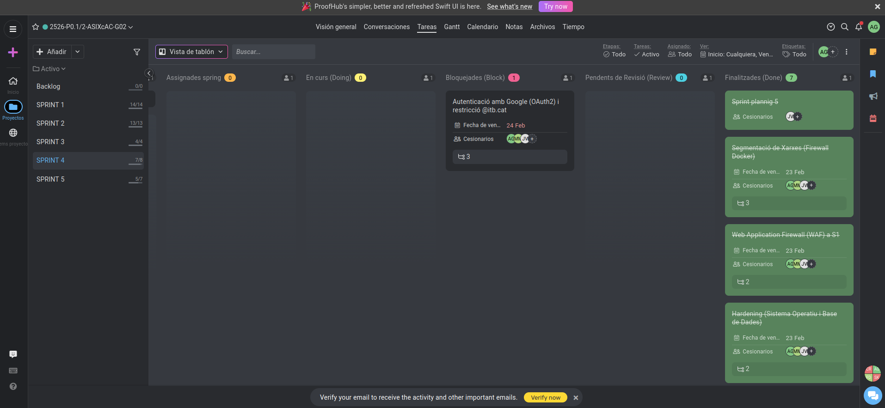
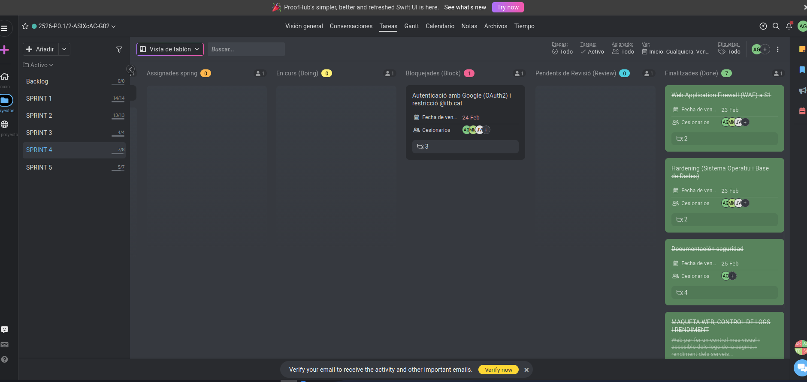

# ACTA DE REUNIÓ - SPRINT 4

**Projecte:** Extagram G2  
**Data:** 24 de febrer de 2026  
**Hora:** 15:00 h  

---

## ASSISTENTS

Adrián González  
Javier Vericat  
Marc Manzorro  

---

## TASQUES COMPLETADES

### 1. Segmentació de Xarxes (Firewall Docker)
**Responsable:** Adrián González  
* **Polítiques de xarxa:** S’han definit regles de comunicació estrictes entre contenidors, limitant cada servei només als ports i xarxes necessaris.  
* **Aïllament avançat:** S’ha reforçat la separació entre front-end, back-end i base de dades per reduir la superfície d’atac en entorns contenidoritzats.  

### 2. Web Application Firewall (WAF) a S1  
**Responsable:** Adrián González  
* **Desplegament del WAF:** S’ha situat un WAF al davant del servei principal per filtrar peticions HTTP malicioses abans d’arribar a l’aplicació.  
* **Regles de protecció:** S’han configurat regles bàsiques contra injeccions SQL, XSS i altres vectors comuns de les aplicacions web.  

### 3. Hardening (Sistema Operatiu i Base de Dades)  
**Responsable:** Adrián González  
* **Sistema Operatiu:** S’han aplicat mesures de hardening al contenidor i host (desactivació de serveis innecessaris, permisos restrictius i actualització de paquets).  
* **Base de Dades:** S’han revisat rols i credencials, limitant privilegis i restringint accessos des de xarxes no autoritzades.  

### 4. Documentació de Seguretat  
**Responsable:** Adrián González, Marc Manzorro i Javier Vericat  
* **Polítiques i arquitectura:** S’ha ampliat la documentació descrivint la segmentació de xarxes, el funcionament del WAF i les mesures de hardening aplicades.  
* **Procediments operatius:** S’han definit passos per al desplegament segur, monitoratge i resposta davant incidents relacionats amb els nous components de seguretat.  

### 5. Maqueta web – Control de Logs i Rendiment  
**Responsable:** Marc Manzorro  
* **Vista de monitoratge:** S’ha creat una maqueta web per visualitzar de forma més clara els logs de l’aplicació i l’estat dels serveis.  
* **Indicadors clau:** La maqueta inclou mètriques bàsiques de rendiment i accessos per facilitar la detecció de comportaments anòmals.  

### 6. Solució problema web  
**Responsable:** Javier Vericat  
* **Correcció d’errors:** S’han resolt incidències a la interfície web que afectaven la navegació i la càrrega d’algunes vistes.  
* **Verificació funcional:** Després de la correcció s’ha revisat el flux principal de l’usuari per garantir una experiència estable.  

---

## TASQUES PENDENTS (BACKLOG)

### 1. Autenticació amb Google (OAuth2) i restricció `@itb.cat`  
* **Estat:** En curs, bloquejada.  
* **Detall:** Falta finalitzar la integració amb OAuth 2.0 de Google i limitar l’accés a comptes amb domini `@itb.cat`, seguint els fluxos recomanats per Google per a aplicacions web.  

---

## RESUM EXECUTIU

| Categoria             | Valor                         |
|-----------------------|------------------------------:|
| Tasques completades   | 6                             |
| Tasques pendents      | 1                             |
| Percentatge completat | 86 % (aprox.)                 |
| Estat de la seguretat | Enfortida (WAF + hardening + segmentació) |
| Estat del sistema     | Estable amb autenticació pendent |

**Estat del projecte:** El sistema disposa ara d’una arquitectura més robusta gràcies a la segmentació de xarxes, el WAF i el hardening aplicat, mentre que la part funcional de la web i la visibilitat mitjançant logs han millorat notablement; resta completar la integració d’autenticació amb Google per donar per tancat l’abast de seguretat previst.  

---

## ESTAT ACTUAL

**Funciona:**  
* Segmentació de xarxes amb polítiques restrictives entre serveis.  
* Web Application Firewall operatiu davant del servei principal.  
* Mesures de hardening aplicades al sistema operatiu i a la base de dades.  
* Maqueta web per visualitzar logs i rendiment dels serveis.  
* Interfície web corregida i operativa per a l’ús bàsic.  

**Pendent:**  
* Integració completa d’OAuth2 amb Google i restricció de domini `@itb.cat`.  

---

## CONCLUSIÓ

L’equip ha reforçat significativament la **seguretat** i la visibilitat del sistema durant el Sprint 4, incorporant segmentació de xarxes, WAF, hardening i eines de monitoratge. Amb la resolució dels darrers aspectes d’autenticació amb Google, Extagram G2 quedarà preparat per a un entorn de producció segur i controlat.  

---

**Acta redactada:** 24/02/2026 – 15:20 CET  
**Responsable:** Equip Extagram G2  

[Torna a l'Inici](../../README.md)
