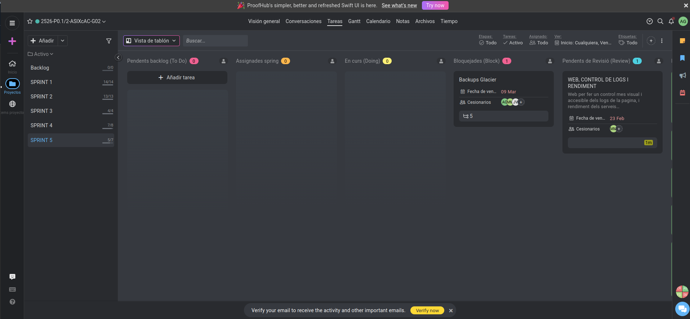

# ACTA DE REUNIÓ - SPRINT 5

**Projecte:** Extagram G2  
**Data:** 10 de març de 2026  
**Hora:** 16:00 h  

---

## ASSISTENTS

Adrián González  
Javier Vericat  
Marc Manzorro  

---

## TASQUES COMPLETADES

### 1. Elasticsearch  
**Responsable:** Adrián González  
**Implementació:** S'ha integrat i configurat amb èxit el servei d'Elasticsearch per a la gestió i cerca de dades del projecte.  

### 2. Documentar Elasticsearch  
**Responsable:** Equip Extagram G2  
**Registre tècnic:** S'ha redactat la documentació pertinent explicant la implementació, configuració i funcionament d'Elasticsearch dins de l'arquitectura del sistema.  

### 3. Fer proves  
**Responsable:** Equip Extagram G2  
**Validació:** S'han dut a terme les bateries de proves necessàries per garantir l'estabilitat dels nous serveis i el correcte funcionament general de l'aplicació abans de la presentació.  

### 4. Presentació  
**Responsable:** Javier Vericat  
**Preparació:** S'ha elaborat el material i l'estructura per a la presentació final del projecte.  

### 5. Documentació i Gestió  
**Responsable:** Equip Extagram G2  
**Organització:** S'han mantingut al dia les tasques de gestió del projecte al ProofHub i s'ha actualitzat la documentació general resultant d'aquest esprint.  

---

## TASQUES PENDENTS I BLOQUEJADES (BACKLOG)

### 1. Backups Glacier  
**Estat:** Bloquejada.  
**Responsables:** Adrián González, Marc Manzorro, Javier Vericat.  
**Detall:** S'ha implementat i validat tota la lògica local (script bash, serveis i temporitzadors systemd) i s'ha creat el bucket S3. No obstant això, la pujada final ha quedat bloquejada per les limitacions de permisos d'AWS Academy (impossibilitat de crear usuaris IAM permanents o assignar rols a la instància EC2). Tota la feina ha quedat documentada per ser funcional en un entorn de producció real.  

### 2. Web, Control de Logs i Rendiment  
**Estat:** Bloquejada.  
**Responsable:** Marc Manzorro.  
**Detall:** Va sorgir la idea de desenvolupar una web pròpia per monitorar els contenidors Docker i tenir un control molt més visual i accessible dels logs i el rendiment dels serveis. La tasca s'ha iniciat però actualment es troba bloquejada a l'espera de finalitzar-ne la integració total.  

---

## RESUM EXECUTIU

| Categoria             | Valor                                   |
|-----------------------|----------------------------------------:|
| Tasques completades   | 5                                       |
| Tasques bloquejades   | 2                                       |
| Percentatge completat | 71 % (aprox.)                           |
| Estat del sistema     | Estable, amb Elasticsearch integrat     |

**Estat del projecte:** El sistema està llest i validat per a la presentació. S'ha integrat correctament Elasticsearch i s'han realitzat les proves adients. Les tasques de backups automàtics al núvol i el monitoratge web propi han quedat bloquejades per motius tècnics i de permisos externs, però s'ha deixat la base tècnica completament preparada i documentada.  

---

## ESTAT ACTUAL

**Funciona:** * Integració d'Elasticsearch operativa.  
Creació de còpies de seguretat en local (script operatiu).  
Documentació del projecte i de sistemes recents actualitzada.  

**Pendent / Bloquejat:** * Pujada automàtica de backups a AWS S3 Glacier (bloquejat per AWS Academy).  
Finalització de la web pròpia de monitoratge de logs de Docker.  

---

## CONCLUSIÓ

L’equip ha tancat el Sprint 5 de manera molt positiva aconseguint implementar eines avançades com Elasticsearch i validant el sistema mitjançant proves exhaustives, deixant-lo a punt per a la presentació. Tot i les frustracions derivades de les restriccions d'AWS per als backups a Glacier, l'equip ha demostrat proactivitat dissenyant solucions pròpies com la plataforma de monitoratge web per als contenidors.  

---

**Acta redactada:** 10/03/2026 – 16:30 CET  
**Responsable:** Equip Extagram G2  

[Torna a l'Inici](../../README.md)