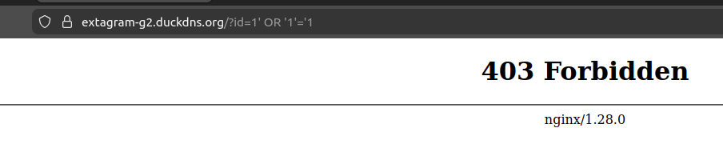

# Documentació de Seguretat: Projecte Extagram

Aquest document detalla l'estratègia de "Defensa en Profunditat" (Defense in Depth) aplicada a la infraestructura del projecte Extagram. S'han implementat múltiples capes de seguretat per protegir l'aplicació web, el servidor amfitrió i les dades dels usuaris.

---

## 1. Web Application Firewall (WAF) - ModSecurity
Per protegir l'aplicació contra atacs a nivell d'aplicació (Capa 7 del model OSI), s'ha desplegat un WAF integrat en el contenidor de proxy invers (`s1-proxy` amb Nginx).

* **Inspecció de trànsit HTTP/HTTPS:** ModSecurity analitza cada petició entrant abans que arribi als contenidors backend (PHP).
* **Regles OWASP CRS:** S'utilitzen les *Core Rule Sets* per detectar i bloquejar proactivament patrons d'atacs comuns, com ara:
    * Injecció SQL (SQLi).
    * Cross-Site Scripting (XSS).
    * Execució remota de codi (RCE).
    * Anomalies en el protocol HTTP.

**Comprovació seguretat WAF (amb una injecció SQL):**

## 2. Seguretat de Xarxa i Tallafocs (iptables + AWS)
El control d'accés a la xarxa es gestiona mitjançant un enfocament de doble capa per garantir que Docker no exposi ports de manera accidental.

* **Capa Cloud (AWS Security Groups):** Actua com a perímetre principal, bloquejant el trànsit no desitjat abans que assoleixi la instància EC2.
    * Permet trànsit HTTP (80) i HTTPS (443) des de qualsevol origen (`0.0.0.0/0`).
    * Restringeix l'accés SSH (22) **únicament a la IP pública de l'administrador**.
* **Capa Host (iptables - `DOCKER-USER`):** Atès que Docker manipula les regles de xarxa saltant-se tallafocs tradicionals com UFW, s'ha configurat directament la cadena `DOCKER-USER` d'`iptables`.
    * Es permet el trànsit legítim cap als ports mapejats internament del proxy.
    * S'aplica una regla `DROP` per defecte per rebutjar qualsevol petició externa que intenti accedir directament als contenidors interns (bypass de proxy).
    * Es permet el trànsit entre contenidors (`RETURN`) i les connexions prèviament establertes (`ESTABLISHED`).

## 3. Hardening del Sistema Operatiu (SO)
La màquina amfitriona (Ubuntu/Debian) ha estat assegurada seguint els principis de mínim risc d'exposició:

* **Accés SSH segur:** Deshabilitació de l'inici de sessió amb contrasenya a favor de l'autenticació mitjançant claus criptogràfiques (SSH Keys).
* **Restricció de Root:** L'accés remot a l'usuari `root` a través d'SSH està deshabilitat.
* **Superfície d'atac reduïda:** Els ports no essencials estan tancats per defecte i el sistema es manté actualitzat mitjançant la gestió de paquets.

## 4. Hardening de la Base de Dades (MySQL)
El contenidor de la base de dades (`s7-database`) ha estat blindat tant a nivell de xarxa com a nivell intern per evitar el robatori o alteració de dades.

* **Aïllament de Xarxa:** El contenidor no exposa cap port a l'exterior (no hi ha directiva `ports` al `docker-compose.yml`). Està connectat exclusivament a una xarxa interna (`datanet` amb `internal: true`), fent impossible el seu accés des de fora del clúster de Docker.
* **Protecció d'Arrencada (Startup Flags):**
    * `--local-infile=0`: Bloqueja la càrrega d'arxius locals per mitigar injeccions SQL que intentin llegir arxius del sistema.
    * `--skip-show-database`: Impedeix que usuaris sense privilegis puguin llistar l'estructura d'altres bases de dades.
* **Principi de Mínim Privilegi (RBAC):**
    * L'aplicació web no utilitza l'usuari `root`. S'ha creat un usuari específic (`extagram_user`) que **només** té permisos de lectura, escriptura i modificació (`SELECT, INSERT, UPDATE, DELETE`) sobre la base de dades de l'aplicació. No té permisos estructurals (`DROP`, `GRANT`, `CREATE`).
* **Neteja d'usuaris per defecte:** Mitjançant l'script `init.sql`, s'han eliminat els usuaris anònims, s'ha esborrat la base de dades de prova (`test`), i s'ha restringit l'accés de l'usuari `root` exclusivament a l'entorn local (`localhost`).